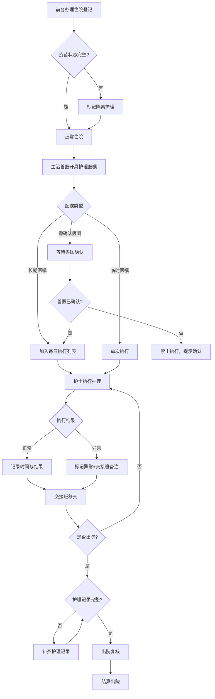

## 1. 产品概述

宠物医院住院护理系统——围绕住院部交接班流程，实现前台、主治兽医、护士、药房和结算人员围绕同一只宠物的住院单协作。系统覆盖从入院登记、护理医嘱、护理执行、交接班到出院结算的完整链路，确保疫苗状态、隔离要求、押金和主人授权等关键信息在各角色间实时同步。

## 2. 核心功能

### 2.1 用户角色

| 角色 | 进入方式 | 核心权限 |
|------|----------|----------|
| 前台 | 工号登录 | 办理住院/出院登记、押金管理、主人授权记录 |
| 主治兽医 | 工号登录 | 开具/变更护理医嘱（长期/临时/需确认）、确认医嘱、出院复核 |
| 护士 | 工号登录 | 执行护理医嘱、记录喂药观察、交接班备注、标记异常 |
| 药房 | 工号登录 | 医嘱药品出库确认、库存扣减 |
| 结算人员 | 工号登录 | 费用汇总、押金抵扣、结算出账 |

### 2.2 功能模块

1. **住院工作台**: 住院列表、状态看板、快捷操作入口
2. **住院登记**: 宠物信息、疫苗状态、隔离要求、押金、主人授权
3. **护理医嘱**: 长期/临时/需确认医嘱管理、医嘱变更
4. **护理执行**: 喂药观察记录、时间戳、异常标记、交接班备注
5. **交接班**: 班次切换、未完成事项移交、漏执行提醒
6. **费用结算**: 费用汇总、押金不足预警、出院复核

### 2.3 页面详情

| 页面名称 | 模块名称 | 功能描述 |
|----------|----------|----------|
| 住院工作台 | 状态看板 | 按状态（住院中/待出院/已出院）展示住院列表，显示疫苗缺失、押金不足预警标识 |
| 住院工作台 | 快捷操作 | 前台→登记、兽医→开医嘱、护士→执行、药房→出库、结算→费用 |
| 住院登记 | 宠物信息 | 登记宠物名/种类/品种/年龄/体重，关联主人信息 |
| 住院登记 | 疫苗与隔离 | 录入疫苗状态（完整/缺失/未知），缺失时自动标记隔离护理需求 |
| 住院登记 | 押金与授权 | 录入押金金额、主人授权（手术/输血/特殊检查授权签名） |
| 护理医嘱 | 医嘱列表 | 按类型（长期/临时/需确认）分类展示，需确认医嘱高亮 |
| 护理医嘱 | 医嘱变更 | 兽医修改/停用医嘱，记录变更原因与时间 |
| 护理医嘱 | 医嘱确认 | 兽医确认待确认医嘱，未确认的不可执行 |
| 护理执行 | 执行面板 | 按时间线展示待执行/已执行医嘱，一键标记完成 |
| 护理执行 | 观察记录 | 喂药时间、观察结果、异常描述、交接班备注 |
| 护理执行 | 漏执行提醒 | 超时未执行的医嘱自动标红，交接班时重点提醒 |
| 交接班 | 交接概览 | 当班完成/未完成事项、异常汇总、重点宠物标注 |
| 交接班 | 班次移交 | 下一班护士确认接收，未完成事项自动带入 |
| 费用结算 | 费用汇总 | 住院费、药品费、护理费、检查费分类汇总 |
| 费用结算 | 押金预警 | 押金余额不足时黄色预警、严重不足时红色预警 |
| 费用结算 | 出院复核 | 校验全部护理记录完整性、未完成医嘱处理、费用确认后结算 |

## 3. 核心流程

住院业务主流程：前台登记 → 兽医开医嘱 → 护士执行护理 → 交接班 → 出院结算

## 4. 用户界面设计

### 4.1 设计风格

- 主色调：医疗蓝 `#2563EB`，辅助色：活力橙 `#F97316`（预警）、薄荷绿 `#10B981`（正常状态）
- 按钮：圆角8px，主操作实心蓝底白字，危险操作橙底白字
- 字体：思源黑体 Noto Sans SC，标题18px/粗体，正文14px/常规，注释12px/浅色
- 布局：左侧导航 + 顶部角色切换 + 右侧主内容区
- 图标：Lucide图标，风格统一、线条简洁
- 卡片式布局，状态标签彩色圆角胶囊

### 4.2 页面设计概览

| 页面名称 | 模块名称 | UI元素 |
|----------|----------|--------|
| 住院工作台 | 状态看板 | 顶部统计卡片（住院数/待医嘱/待执行/预警），下方表格带状态标签与操作按钮 |
| 住院工作台 | 预警横幅 | 押金不足黄色横幅、疫苗缺失橙色横幅，可关闭 |
| 住院登记 | 表单卡片 | 分组卡片：基本信息/疫苗隔离/押金授权，每组有独立提交区域 |
| 护理医嘱 | 医嘱分类Tab | 三个Tab（长期/临时/需确认），每个Tab下表格+新增按钮 |
| 护理医嘱 | 医嘱详情侧滑 | 右侧抽屉展示医嘱详情与变更记录 |
| 护理执行 | 时间线面板 | 左侧时间线、右侧执行表单，异常用红色标记 |
| 交接班 | 双栏对照 | 左栏当班总结、右栏接班确认，中间箭头动画 |
| 费用结算 | 费用明细表 | 分类折叠面板，底部汇总，押金余额进度条 |

### 4.3 响应式

桌面优先设计，最小宽度1280px，侧边栏可折叠适配笔记本

### 4.4 3D场景

不适用
