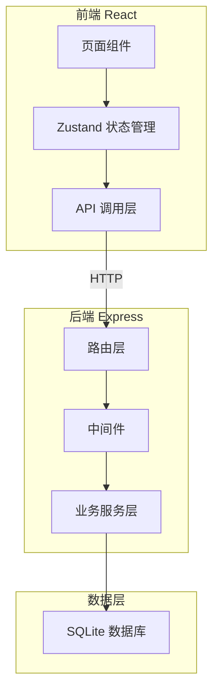
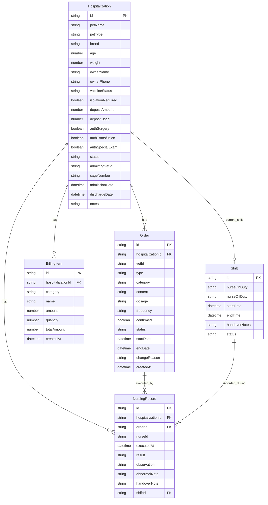

## 1. 架构设计



## 2. 技术说明

- 前端：React@18 + TypeScript + Tailwind CSS@3 + Vite + Zustand
- 初始化工具：vite-init（react-express-ts 模板）
- 后端：Express@4 + TypeScript (ESM)
- 数据库：SQLite（better-sqlite3），适合单机部署场景
- 图标：lucide-react

## 3. 路由定义

| 路由 | 用途 |
|------|------|
| / | 住院工作台首页 |
| /admission/:id | 住院登记/详情页 |
| /orders/:id | 护理医嘱页面 |
| /nursing/:id | 护理执行页面 |
| /handover | 交接班页面 |
| /billing/:id | 费用结算页面 |

## 4. API 定义

### 4.1 住院管理

```
GET    /api/hospitalizations          获取住院列表（支持状态筛选）
GET    /api/hospitalizations/:id      获取住院详情
POST   /api/hospitalizations          创建住院登记
PUT    /api/hospitalizations/:id      更新住院信息
POST   /api/hospitalizations/:id/discharge  办理出院

类型定义：
Hospitalization {
  id: string
  petName: string
  petType: string         // 猫/狗/兔/其他
  breed: string
  age: number
  weight: number
  ownerName: string
  ownerPhone: string
  vaccineStatus: 'complete' | 'incomplete' | 'unknown'
  isolationRequired: boolean
  depositAmount: number
  depositUsed: number
  authSurgery: boolean
  authTransfusion: boolean
  authSpecialExam: boolean
  status: 'admitted' | 'discharged'
  admittingVetId: string
  admittingNurseId: string
  cageNumber: string
  admissionDate: string
  dischargeDate: string | null
  notes: string
}
```

### 4.2 护理医嘱

```
GET    /api/hospitalizations/:id/orders      获取住院单的医嘱列表
POST   /api/hospitalizations/:id/orders      新增医嘱
PUT    /api/orders/:orderId                   更新医嘱
POST   /api/orders/:orderId/confirm           确认医嘱
POST   /api/orders/:orderId/stop              停用医嘱

类型定义：
Order {
  id: string
  hospitalizationId: string
  vetId: string
  type: 'long_term' | 'temporary' | 'pending_confirm'
  category: 'medication' | 'observation' | 'care' | 'examination'
  content: string
  dosage: string
  frequency: string          // 长期医嘱的执行频率
  startDate: string
  endDate: string | null
  confirmed: boolean
  confirmedBy: string | null
  confirmedAt: string | null
  status: 'active' | 'stopped' | 'completed'
  changeReason: string | null
  createdAt: string
  updatedAt: string
}
```

### 4.3 护理执行

```
GET    /api/hospitalizations/:id/nursing-records   获取护理记录
POST   /api/hospitalizations/:id/nursing-records    新增护理执行记录
PUT    /api/nursing-records/:recordId               更新护理记录

类型定义：
NursingRecord {
  id: string
  hospitalizationId: string
  orderId: string
  nurseId: string
  executedAt: string
  result: 'normal' | 'abnormal' | 'refused'
  observation: string
  abnormalNote: string | null
  handoverNote: string | null
  shiftId: string
}
```

### 4.4 交接班

```
GET    /api/shifts/current         获取当前班次
POST   /api/shifts/handover        交接班
GET    /api/shifts/:id/summary     获取班次总结

类型定义：
Shift {
  id: string
  nurseOnDuty: string
  nurseOffDuty: string | null
  startTime: string
  endTime: string | null
  handoverNotes: string
  incompleteOrders: string[]
  abnormalRecords: string[]
  status: 'active' | 'handed_over'
}
```

### 4.5 费用结算

```
GET    /api/hospitalizations/:id/billing      获取费用明细
POST   /api/hospitalizations/:id/billing      新增费用项
POST   /api/hospitalizations/:id/settle        结算出院

类型定义：
BillingItem {
  id: string
  hospitalizationId: string
  category: 'hospitalization' | 'medication' | 'nursing' | 'examination' | 'other'
  name: string
  amount: number
  quantity: number
  totalAmount: number
  createdAt: string
}

BillingSummary {
  hospitalizationId: string
  totalAmount: number
  depositAmount: number
  depositUsed: number
  depositRemaining: number
  depositWarning: 'none' | 'low' | 'critical'
  items: BillingItem[]
  allNursingComplete: boolean
  incompleteRecords: string[]
}
```

## 5. 服务端架构


## 6. 数据模型

### 6.1 数据模型定义



### 6.2 数据定义语言

```sql
CREATE TABLE hospitalization (
  id TEXT PRIMARY KEY,
  pet_name TEXT NOT NULL,
  pet_type TEXT NOT NULL,
  breed TEXT DEFAULT '',
  age INTEGER DEFAULT 0,
  weight REAL DEFAULT 0,
  owner_name TEXT NOT NULL,
  owner_phone TEXT NOT NULL,
  vaccine_status TEXT NOT NULL DEFAULT 'unknown',
  isolation_required INTEGER NOT NULL DEFAULT 0,
  deposit_amount REAL NOT NULL DEFAULT 0,
  deposit_used REAL NOT NULL DEFAULT 0,
  auth_surgery INTEGER NOT NULL DEFAULT 0,
  auth_transfusion INTEGER NOT NULL DEFAULT 0,
  auth_special_exam INTEGER NOT NULL DEFAULT 0,
  status TEXT NOT NULL DEFAULT 'admitted',
  admitting_vet_id TEXT DEFAULT '',
  admitting_nurse_id TEXT DEFAULT '',
  cage_number TEXT DEFAULT '',
  admission_date TEXT NOT NULL,
  discharge_date TEXT,
  notes TEXT DEFAULT '',
  created_at TEXT NOT NULL DEFAULT (datetime('now')),
  updated_at TEXT NOT NULL DEFAULT (datetime('now'))
);

CREATE TABLE orders (
  id TEXT PRIMARY KEY,
  hospitalization_id TEXT NOT NULL,
  vet_id TEXT NOT NULL,
  type TEXT NOT NULL,
  category TEXT NOT NULL DEFAULT 'medication',
  content TEXT NOT NULL,
  dosage TEXT DEFAULT '',
  frequency TEXT DEFAULT '',
  start_date TEXT NOT NULL,
  end_date TEXT,
  confirmed INTEGER NOT NULL DEFAULT 0,
  confirmed_by TEXT,
  confirmed_at TEXT,
  status TEXT NOT NULL DEFAULT 'active',
  change_reason TEXT,
  created_at TEXT NOT NULL DEFAULT (datetime('now')),
  updated_at TEXT NOT NULL DEFAULT (datetime('now')),
  FOREIGN KEY (hospitalization_id) REFERENCES hospitalization(id)
);

CREATE TABLE nursing_record (
  id TEXT PRIMARY KEY,
  hospitalization_id TEXT NOT NULL,
  order_id TEXT NOT NULL,
  nurse_id TEXT NOT NULL,
  executed_at TEXT NOT NULL,
  result TEXT NOT NULL DEFAULT 'normal',
  observation TEXT DEFAULT '',
  abnormal_note TEXT,
  handover_note TEXT,
  shift_id TEXT,
  created_at TEXT NOT NULL DEFAULT (datetime('now')),
  FOREIGN KEY (hospitalization_id) REFERENCES hospitalization(id),
  FOREIGN KEY (order_id) REFERENCES orders(id),
  FOREIGN KEY (shift_id) REFERENCES shift(id)
);

CREATE TABLE billing_item (
  id TEXT PRIMARY KEY,
  hospitalization_id TEXT NOT NULL,
  category TEXT NOT NULL,
  name TEXT NOT NULL,
  amount REAL NOT NULL,
  quantity INTEGER NOT NULL DEFAULT 1,
  total_amount REAL NOT NULL,
  created_at TEXT NOT NULL DEFAULT (datetime('now')),
  FOREIGN KEY (hospitalization_id) REFERENCES hospitalization(id)
);

CREATE TABLE shift (
  id TEXT PRIMARY KEY,
  nurse_on_duty TEXT NOT NULL,
  nurse_off_duty TEXT,
  start_time TEXT NOT NULL,
  end_time TEXT,
  handover_notes TEXT DEFAULT '',
  status TEXT NOT NULL DEFAULT 'active',
  created_at TEXT NOT NULL DEFAULT (datetime('now'))
);

CREATE TABLE staff (
  id TEXT PRIMARY KEY,
  name TEXT NOT NULL,
  role TEXT NOT NULL,
  code TEXT NOT NULL UNIQUE,
  created_at TEXT NOT NULL DEFAULT (datetime('now'))
);

CREATE INDEX idx_hospitalization_status ON hospitalization(status);
CREATE INDEX idx_orders_hosp_id ON orders(hospitalization_id);
CREATE INDEX idx_orders_type ON orders(type);
CREATE INDEX idx_nursing_record_hosp_id ON nursing_record(hospitalization_id);
CREATE INDEX idx_nursing_record_order_id ON nursing_record(order_id);
CREATE INDEX idx_billing_item_hosp_id ON billing_item(hospitalization_id);
CREATE INDEX idx_shift_status ON shift(status);
```
